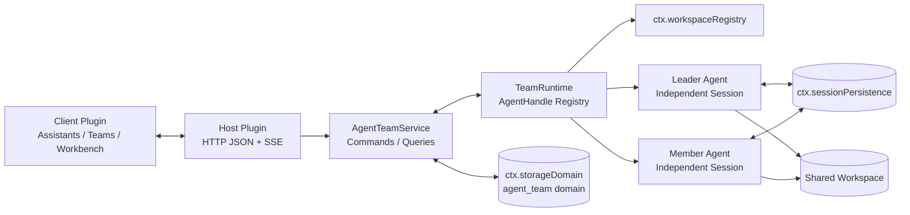

# 01. 总体技术架构

## 审核结论

本方案可以使用 DeepSeek Harness 当前公开的插件接口实现。团队解散会停止并释放成员运行时、解除 Workspace 活动关联，并删除插件拥有的团队、任务、消息与活动数据；助手模板和 Workspace 文件保留。Harness 当前没有公开的 Session 物理删除接口，因此旧 Session 持久化日志可能继续存在，但不再归属、恢复或展示为该团队。

首个可交付版本限定为 **DeepSeek Harness Web Profile 插件**。这是因为 `dsh.client` 的公开平台是 `web`，而公开的 `ctx.webServer` 路由只服务浏览器；Electron 的 `file://` 与 IPC 请求桥不承诺转发第三方自定义路由。

## 架构



## 一个安装包，内部模块化

开发指南建议不要预防性拆包。首版使用一个 npm 组合包 `dsh-agent-team`，同时提供 Host 和 Client 入口：

```text
dsh-agent-team/
  package.json
  cordis.patch.yml
  tsdown.config.ts
  src/
    index.ts                 # Host Cordis 插件入口
    config.ts                # Schemastery Config
    domain/                  # 类型、状态机、错误码
    storage/                 # ctx.storageDomain 适配层
    service/                 # 助手与团队应用服务
    runtime/                 # AgentHandle、投递、恢复
    tools/                   # defineTool 团队工具
    transport/               # WebServer HTTP/SSE
    client/
      index.ts               # Browser Cordis 插件入口
      components/
      stores/
      locales/
```

只有某项能力确实需要独立替换提供方时，再按 Service Definition / Provider / Consumer 方式拆包。

## 可安装组合包

`package.json` 需要同时声明：

- `dsh.bundle.patch = "./cordis.patch.yml"`，使 `dsh plugin add` 能把插件层加入 Profile。
- `dsh.client.platform = "web"` 和所需 Client 依赖，使 Browser 入口被模块加载器发现。
- `exports["."]` 指向 Host 入口，`exports["./client"]` 指向 Browser 入口。
- `files` 包含构建产物、类型声明和 `cordis.patch.yml`。
- GitHub 源码安装时提供自包含 `prepare` 构建脚本；npm/tarball 则发布预构建产物。

`cordis.patch.yml` 只插入一个 `dsh-agent-team` 行。服务依赖通过插件导出的 `inject` 声明等待，不依赖 patch 行顺序碰运气。

## Host 插件服务依赖

Host 入口声明并使用以下公开服务：

| 服务 | 用途 |
| --- | --- |
| `agents` | `ctx.agents.create/resume` 和运行实例查找 |
| `llm` | `listProviders/listModels/resolveModelInfo` |
| `agentPresets` | 在 Agent `setup` 中挂载基础 Preset |
| `tools` | Agent scope 工具限制与团队工具注册 |
| `skills` | 启动时校验 Agent-scope Skill Catalog |
| `permissionPresets` | 为新成员 Session 选择 Harness 权限预设 |
| `storageDomain` | 保存助手、团队聚合、信箱和活动记录 |
| `workspaceRegistry` | 解析规范 Workspace、关联成员 Session |
| `sessionPersistence` | 恢复和检查成员 Session；当前不能删除 |
| `webServer` | 注册 Web JSON API 与 SSE 路由 |

依赖缺失时 Cordis 会让插件保持 `PENDING`，不会用空状态掩盖配置错误。

## 独立 Agent 的确切创建方式

每个成员由插件根级 `TeamRuntime` 创建。`sessionId` 使用插件自有命名空间（例如 `agent-team:<uuid>`），既保持全局唯一，也让 Client 的纯 Composer selector 只根据当前 Session 快照识别团队会话。以下是接口级伪代码：

```ts
const handle = await ctx.agents.create({
  sessionId: SessionId(member.sessionId),
  meta: {
    cwd: workspace.path,
    agentPreset: snapshot.agentPresetId,
  },
  agentOptions: {
    provider: snapshot.provider,
    model: snapshot.model,
  },
  setup: async (agentCtx) => {
    await ctx.agentPresets.mount(agentCtx, snapshot.agentPresetId)
    agentCtx.systemPrompt.section({
      name: 'agent-team:assistant',
      order: 10,
      text: snapshot.instructions,
    })
    agentCtx.systemPrompt.section({
      name: 'agent-team:role',
      order: 11,
      text: renderTeamRole(member),
    })
    agentCtx.tools.restrict({ allow: snapshot.toolAllowlist })
    registerTeamTools(agentCtx, member)

    const agent = agentCtx.agent
    if (agent === undefined) throw new Error('missing unpublished agent')
    const assembly = await agentCtx.systemPrompt.assemble(assembleContextFor(agent))
    const names = new Set(assembly.sections.map(section => section.name))
    if (!names.has('agent-team:assistant') || !names.has('agent-team:role')) {
      throw new PresetPromptIncompatibleError(snapshot.agentPresetId)
    }
  },
})

ctx.permissionPresets.set(handle.agent.session, snapshot.permissionPresetId)
await workspace.attachSession(handle.agent.id)
```

实现注意事项：

- `meta.cwd` 必须使用 `workspaceRegistry` 返回的规范绝对路径，不能只在提示词中声明 Workspace。
- `provider` 和 `model` 在可启动模板中必须同时存在；Agent 请求边界最终要求二者齐全。
- 模板提示词作为唯一命名的补充段落注册，避免与 Preset 自带的 `deployment:persona` 冲突。
- Preset 可能贡献 `complete: true` 的完整 Prompt，从而排除其他段；`setup` 使用公开 `assembleContextFor()` 和 `systemPrompt.assemble()` 预检两个团队段确实生效。不兼容时在发布前抛错，由原子创建窗口回滚。
- `tools.restrict()` 只限制继承的全局工具；随后注册的 Agent scope 团队工具仍然可见，符合 Harness 约定。
- 如果启用 Skill 白名单，启动时从 Agent scope Skill Catalog 校验名称，并用 Agent-scope `ctx.tools.guard()` 单调拒绝不在白名单中的 `skill` 调用；不假设 SkillRegistry 存在白名单 API。
- 不填写 `origin`、`parentSession`、`seedLength` 或 `delegationDepth`，因此成员没有 Subagent 血统。

恢复时调用 `ctx.agents.resume({ resumeSessionId, agentOptions, setup })`。Workspace 来自已持久化的 Session Header；恢复后必须验证它仍与团队 Workspace 一致。

## 生命周期所有权

`TeamRuntime` 是唯一保存成员 `AgentHandle` 的对象，以 `(teamId, slotId)` 索引。Leader 只能调用团队工具，不能接触其他成员 Handle。

Host 插件把完整运行时清理放在一个 `ctx.effect()` disposer 中，按顺序执行：停止接收新命令、取消或排空 Agent、等待 `whenIdle()`、必要时 `ctx.sessions.flush(session)`、调用 `handle.dispose()`、关闭 storage domain。开发指南明确指出多个异步 disposer 可能并发，因此存在顺序依赖的清理不能拆成互相独立的 effects。

即使显式清理失败，Agent Handle 仍受创建它的 Cordis Fiber 所有，插件卸载会触发结构性回收。

## 领域存储

插件不自行硬编码 JSONL/SQLite 路径，也不直接访问存储后端。它通过 `ctx.storageDomain.open(defineDomain(...))` 打开 `agent_team` 领域，并在 disposer 中调用 `Domain.close()`。

Harness Domain KV 没有跨表事务。因此需要原子保持的 Team、Leader、成员、任务和 Lease 放在一个 `TeamAggregate` 记录中，通过 `table.update(teamId, fn)` 串行化更新；消息和活动记录使用独立表，并通过可恢复状态机处理跨记录步骤。具体见[领域模型与持久化](./02-domain-model-and-persistence.md)。

## Host 与 Client 通信

首版使用公开且可独立打包的 `ctx.webServer.register()`：

- `/agent-team/api`：JSON 命令与查询。
- `/agent-team/events`：SSE 增量通知。

这是明确的 Web-only 实现。Host 对请求进行方法、来源、Body 大小、Schema、权限和幂等校验；Client 断线后重新拉取快照，不依赖 SSE 重放获得真相。

Typert Remote 是 Harness 内建包使用的强类型一元 RPC，但严格构建依赖 Host 聚合、生成的 `./typert`/`./remote` 工件和 Client contribution 挂载。当前用户开发指南没有证明树外组合包能独立加入这条生成链，因此它只作为后续优化 Spike，不再是首版前提。Typert 即使采用，也不能承载 SSE 增量流。

## Client UI 扩展位

Client 插件使用现有公开 Slot：

- `settings.section`：注册“Agent 团队”设置页，只管理助手模板。
- `sidebar.footer.action`：在侧栏底部注册“团队 +”一级入口，并在其下渲染已创建团队的二级菜单。
- `shell.overlay`：注册团队列表、组建器、管理抽屉和完整多列 Conversation 工作台。
- Harness rc.6 没有开放 `sidebar.workspaces` 内部扩展 Slot；不修改 Harness 源码，不使用 DOM/CSS 注入。
- `conversation.session.header.actions`：可选的标准单 Session“返回团队”入口。

注册时必须先调用 `ctx.slots.inject(slotName, () => ctx.slots.register(...))`，确保父 Slot 已存在。工作台不覆盖 `conversation` single Slot，也不接管官方 Composer；Host 用公开 `session/event` 和 `sessionPersistence.inspect/readFrom` 建立成员 Conversation 投影。`ctx.sessions.open(sessionId)` 只用于打开标准单 Session 辅助页面。

成员 Session 的标准 Composer 由插件接管并通过 Team Service 投递。用户可以停止单个成员当前输出，或通过团队级“清空任务与上下文”轮换全部 Session。Runtime 每次冷恢复或变更前都检查 `ctx.agents.get(sessionId)`：如果发现 live Agent 但自己没有对应 Handle，进入 `ownership_conflict` 并停止操作，绝不能把 bare `Agent` 当作可销毁 Handle。

## 已知边界：Session 日志物理删除

审核基线中的公开 `SessionPersistence` 没有 `delete`，`AgentHandle.dispose()` 也只移除运行 Agent 和内存 Session。`Workspace.detachSession/archiveSession` 明确不删除持久日志。

因此插件不能承诺物理擦除 Harness 的旧 Session 日志，也不能把 `locate().path` 当作授权直接删 JSONL 文件；SQLite 后端甚至没有单 Session 路径。该限制不阻塞产品层的团队解散：团队领域记录和运行时归属仍可完整删除，遗留日志只作为 Harness 自身的孤立历史保留。

## 验收标准

- 组合包可通过 `dsh plugin --profile <name> add` 安装，并能从 Profile 完整卸载。
- Host/Client 入口、配置、服务依赖和清理都符合 Cordis 生命周期。
- 两个成员通过根级 `ctx.agents.create` 获得不同 Session、不同模型和同一规范 Workspace。
- 所有 UI 都使用已存在的公开 Slot；多列工作台注册在 `shell.overlay`，不覆盖任何 single Slot。
- 领域数据只通过 `ctx.storageDomain` 写入。
- 解散后团队不再出现在列表中，成员不会恢复，助手模板和 Workspace 文件保持不变；遗留 Session 日志不再归属团队。
