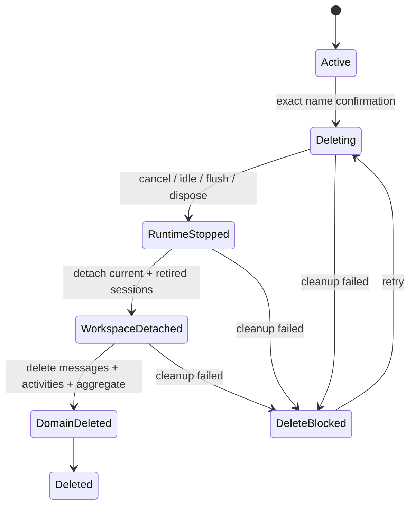

# 02. 领域模型与持久化

## 实现基础

团队领域数据使用 Harness 的 `ctx.storageDomain`，不自行管理数据库文件。Session 对话继续使用 `ctx.sessionPersistence`。两类存储不能做原子事务，因此跨边界流程必须是可恢复状态机。

团队 Agent 小助手的模型偏好使用独立的 `agent_team_assistant_builder` Domain 全局记录保存，不改变已有 `agent_team` Domain 的描述符。记录同时保存每个会话的 Provider/Model 和最近一次手动选择；历史会话恢复自己的模型，新会话继承最近一次选择。若已保存模型从 Harness 目录下架，Runtime 会记录告警并回退到插件配置或当前目录默认模型。

## 助手模板

```ts
type AssistantTemplate = {
  schemaVersion: 1;
  id: string;
  name: string;
  description?: string;
  icon?: string;
  instructions: string;
  provider: string;
  model: string;
  agentPresetId: string;
  permissionPresetId: string;
  toolAllowlist: string[];
  skillAllowlist: string[];
  mcpServers: string[];
  revision: number;
  createdAt: string;
  updatedAt: string;
};
```

`skillAllowlist` 是为兼容首版持久化结构保留的内部字段名；产品语义是“这个助手已选择、可以使用的 Skills”，不是面向用户的白名单。空数组表示不使用任何 Skill。Skill 正文不进入模板，成员执行任务时由 Harness 根据名称按需加载当前 Workspace 中的胜出定义。

`mcpServers` 保存用户从所选 Agent Preset 真实工具目录中选择的 MCP Server 名称；空数组表示不使用 MCP。连接方式、启动命令、URL 和凭据只存在于 Harness Profile/Preset 的官方 MCP Client 配置中，不进入助手模板。旧记录缺少该字段时按空数组读取。

`toolAllowlist` 同样只作为首版记录的兼容字段保留。新建和更新时强制写为空数组，启动迁移会清除历史值，成员运行时不会读取它；工具能力完全由 Agent Preset 和权限预设决定。

Provider 和 Model 是可启动模板的必填字段。候选项来自 `ctx.llm.listProviders()` 和 `ctx.llm.listModels(provider)`；UI 使用 Provider 联动的模型下拉框完整展示真实候选项，不提供自定义模型 ID。后端仍用 `ctx.llm.resolveModelInfo()` 做最终校验。

模板只保存 Provider 路由和模型 ID，不保存 API Key、Token 或 Harness Settings 内容。

## 团队聚合

Harness Domain KV 没有跨表事务。为了原子维护唯一 Leader、成员、任务归属以及任务通知待发事件，以下数据放在同一 `TeamAggregate` 记录中：

```ts
type TeamAggregate = {
  schemaVersion: 1;
  id: string;
  name: string;
  workspaceId: string;
  workspacePath: string;
  leaderSlotId: string;
  state: "draft" | "starting" | "active" | "ownership_conflict" | "deleting" | "delete_blocked" | "error";
  directMemberChat: boolean;
  members: Record<string, TeamMemberSlot>;
  retiredSessions: Record<string, RetiredMemberSession>;
  tasks: Record<string, TeamTask>;
  leases: Record<string, FileScopeLease>;
  outbox: Record<string, TeamMessage>;
  revision: number;
  createdAt: string;
  updatedAt: string;
};

type TeamMemberSlot = {
  id: string;
  assistantId: string;
  displayName: string;
  role: "leader" | "member";
  assistantSnapshot: AssistantSnapshot;
  permissionPresetId?: string;
  sessionId: string;
  desiredState: "online" | "offline" | "removing";
  lastRuntimeState: MemberRuntimeState;
  joinedAt: string;
};

type RetiredMemberSession = {
  formerSlotId: string;
  sessionId: string;
  displayName: string;
  removedAt: string;
};
```

`displayName` 是为消息、任务和历史记录保存的助手名称快照，固定取自 `assistantSnapshot.name`，不是用户可编辑的成员别名。同一助手模板可产生多个同名成员实例，成员身份始终由 `slotId` 区分。早期版本保存的自定义名称或自动编号会在插件启动时归一为助手快照名称。

早期版本持久化的 `paused` 只作为旧数据输入值保留在 Schema 编解码层；插件启动时会将其一次性迁移为 `active`，不会再向 Runtime、Host API 或 UI 暴露暂停状态。

`AssistantTemplate.permissionPresetId` 是创建成员时的默认权限；`TeamMemberSlot.permissionPresetId` 是该成员当前 Session 的运行权限。聊天窗口切换权限只更新成员字段，不修改模板或不可变助手快照。早期成员记录缺少该字段时，运行时回退到 `assistantSnapshot.permissionPresetId`。

`MemberRuntimeState` 是插件投影，不等同于 Harness `AgentStatus`。Harness 公开状态只有 `idle | running`；插件额外的 `offline`、`starting`、`waiting_approval` 和 `error` 分别由 Handle 是否存在、启动流程、未闭合的 `approval/asked`/`approval/decided` 事件对及插件错误记录派生。

## 任务

```ts
type TeamTask = {
  id: string;
  title: string;
  description: string;
  status: "pending" | "assigned" | "running" | "blocked" | "completed" | "failed" | "cancelled";
  ownerSlotId?: string;
  createdBySlotId?: string;
  dependencyIds: string[];
  fileScopes: string[];
  result?: string;
  error?: string;
  revision: number;
  createdAt: string;
  updatedAt: string;
};
```

任务、成员、已移除 Session 索引和待投递任务通知位于同一 TeamAggregate，因此换 Leader、移除成员并处理其任务、任务转派和“状态更新 + 通知 Leader”等操作可以通过一次 `table.update(teamId, pureTransform)` 原子提交。`retiredSessions` 不保存可继续运行的成员配置，只保留最终解散所需的 Session 索引和历史展示摘要。

## 信箱与活动

消息和活动会持续增长，单独存放：

```ts
type TeamMessage = {
  schemaVersion: 1;
  id: string;
  teamId: string;
  sender: { kind: "user" | "member" | "system"; id: string };
  recipient: { kind: "leader" | "member" | "broadcast"; slotId?: string };
  type: "instruction" | "progress" | "result" | "question" | "warning" | "system";
  content: string;
  relatedTaskId?: string;
  attachments: AttachmentRef[];
  deliveryState: "queued" | "delivered" | "read" | "failed";
  idempotencyKey: string;
  createdAt: string;
};
```

活动记录只保存 UI 和诊断所需的结构化摘要，不复制完整模型输出或敏感文件内容。

`TeamAggregate.outbox` 只保存尚未完成投递的任务派发和任务状态通知。Runtime 先把记录复制到消息表并以稳定 MessageId 投递；确认进入目标 Session 后再从 `outbox` 删除。普通显式消息不需要与任务状态同事务更新，直接采用消息表的 `queued -> delivered/failed` 状态机。

## Domain Schema

使用 `defineDomain` 声明首版 DomainSpec。当前 JSON/SQLite Storage 在已存 Domain 的 descriptor version 不一致时会返回 `version-mismatch`，不提供原地 migration。因此首版不把 DomainSpec version 当作应用迁移器；所有持久记录带 `schemaVersion`，Schema 使用可判别的旧/新版本联合，以便插件逐条升级。建议包含：

- `assistants`：`assistantId -> AssistantTemplate`
- `teams`：`teamId -> TeamAggregate`
- `messages`：`messageId -> TeamMessage`
- `activities`：`activityId -> TeamActivity`
- `operations`：删除、恢复和成员同步等长流程状态

Host 插件启动时：

1. `await ctx.storageDomain.open(agentTeamDomainSpec)`。
2. 把返回的 Domain Handle 保存到服务实例。
3. 使用同步 `get/entries` 提供读模型。
4. 所有变更使用 `put/delete/update`，绝不就地修改返回对象。
5. 在同一个有序的 `ctx.effect` disposer 中关闭 Domain。

存储介质由 Profile 中 `storageDomain` 的 `backend/routes` 决定。插件不能假设一定是 JSON 或 SQLite，也不能触碰底层文件。

未来记录升级使用 `operations` 保存 Cursor 和阶段，并通过 `KvTable.update` 幂等地逐条改写；失败后保持旧记录仍可读取，重启可继续。若未来确实需要不兼容的 Domain descriptor 变更，必须先验证“新 Domain 名称 + 显式复制 + 切换”的公开 API 方案，不能直接提高 descriptor version 后期待 Backend 自动迁移。

## 不变量

- 非删除终态 TeamAggregate 必须有且仅有一个 Leader。
- `leaderSlotId` 指向 `members` 中角色为 `leader` 的成员。
- 同一 TeamAggregate 内 `sessionId` 唯一；启动时还要检查全局 `ctx.agents`/Session 列表碰撞。
- `members` 与 `retiredSessions` 的 Session ID 不能重复；解散必须解除两者的团队与 Workspace 活动归属。
- 成员 `sessionId` 使用插件命名空间并保持不可变，使 Client Composer 的纯 selector 可识别团队 Session；团队归属真相仍来自 Domain，不从 ID 反推授权。
- `assistantId` 可以重复，`slotId` 必须唯一。
- 成员名称取自 `assistantSnapshot.name`，允许重名，不能用于成员寻址或授权。
- `workspacePath` 必须等于 `workspaceRegistry.get(workspaceId).path`。
- `deleting` 或 `delete_blocked` 团队拒绝新任务、消息和成员操作。
- `ownership_conflict` 团队拒绝 Runtime 变更，直到外部 live Agent 被其所有者释放并由 Team Runtime 重新取得 `AgentHandle`。
- 模板编辑不改变既有 `assistantSnapshot`。
- 每个 Outbox 消息必须引用当前团队和当前成员；投递成功前不能从 Aggregate 删除。

## 模板快照与同步

加入成员时复制模板配置。显式同步流程：

1. 读取模板目标 Revision。
2. 处理运行中任务：等待或取消。
3. 对保留 Session 的同步，先 `agent.cancel()`、`await agent.whenIdle()`、`await ctx.sessions.flush(session)`、`await handle.dispose()`。
4. 原子更新成员快照。
5. 使用同一 `sessionId` 调用 `ctx.agents.resume()` 并重新执行 `setup`。
6. 如果用户选择新 Session，则生成新 ID、创建 Agent、attach 到 Workspace，并把旧 Session 索引移入 `retiredSessions` 只读历史。Harness 没有公开 Session 物理删除接口，因此插件不提供“立即擦除旧日志”。

## Workspace 关联

- 团队可以选择现有 `WorkspaceId`，也可以在组建团队弹窗中调用 Client `ctx.workspaces.pickDirectory()` 选择目录，再由 `ctx.workspaces.create({ path })` 创建或复用规范记录；后端仍通过 `workspaceRegistry` 校验最终的 `id/path`。
- 创建 Agent 时把 `workspace.path` 写入 `meta.cwd`。
- Agent 创建成功后调用 `workspace.attachSession(sessionId)`，使标准 Harness Session UI 能发现它。
- 恢复前调用 `workspace.status()` 并校验 Session Header cwd。
- 移除成员时调用 `workspace.detachSession(sessionId)` 只会解除活动列表关联，不会删除目录或 Session 日志。
- 解散时解除现任成员与 `retiredSessions` 的 Workspace 活动关联；这不会删除目录或 Harness Session 日志。

## 消息幂等投递

跨 Domain KV 与 Session 日志没有事务。为降低崩溃后的重复投递：

1. 先把 TeamMessage 保存为 `queued`。
2. 用 `TeamMessage.id` 派生稳定的 Harness `MessageId`。
3. 投递前检查目标 Agent inbox、Session 事件和持久化检查结果中是否已经出现该 MessageId。
4. 未出现时，用 `freezeMessage/createMessage` 构建 `source: { kind: "plugin", plugin: "agent-team" }` 的 UserMessage，再调用 `agent.followup(message)`。
5. 确认 Session 已接受该 MessageId 后，把 TeamMessage 更新为 `delivered`。

这个设计保证“同一个业务消息最多形成一个已识别的 Session 输入”。模型或工具产生的外部副作用仍服从各自幂等和审批机制，不能笼统承诺整个任务 exactly-once。

## 恢复

- 启动时扫描状态非终态的 TeamAggregate。
- 对 `desiredState = online` 的成员调用 `ctx.agents.resume()`。
- `resume` 失败时保留原 Session 映射并记录错误，不创建替代 Session。
- 重新扫描 `queued` 消息，根据稳定 MessageId 判断是否需要投递。
- Client SSE 重连不回放全部进程事件，而是重新查询团队快照后从新 Cursor 继续。

## 团队解散状态机



解散会处理所有现任与已移除成员索引，停止并释放仍由插件拥有的运行时，解除 Workspace 活动关联，然后删除消息、活动和 TeamAggregate。任一阶段失败时进入 `delete_blocked` 并允许重试。`assistants` 表和 Workspace 文件不属于解散删除集合，任何 AssistantTemplate 都必须保留。

`SessionPersistence.locate()` 返回的是位置提示，不是删除授权；SQLite 后端返回 `undefined`。任何实现都禁止直接删除 Harness 内部文件，因此底层 Session 日志可能保留，但删除后的团队不会恢复、展示或继续拥有这些 Session。

## 验收标准

- 唯一 Leader、成员与任务关系通过单 TeamAggregate 原子更新保持。
- 插件数据只通过 `ctx.storageDomain` 访问，并能在 JSON/SQLite 路由之间切换。
- 记录升级可中断重试；Domain descriptor version 变化不被误当作受支持的原地迁移。
- Agent 的 `meta.cwd` 与 Workspace 规范路径一致。
- 消息重投使用稳定 MessageId 去重，不承诺无法证明的端到端 exactly-once。
- 解散失败时进入 `delete_blocked`，保留重试所需索引；成功后删除团队领域数据并保留助手模板与 Workspace 文件。
