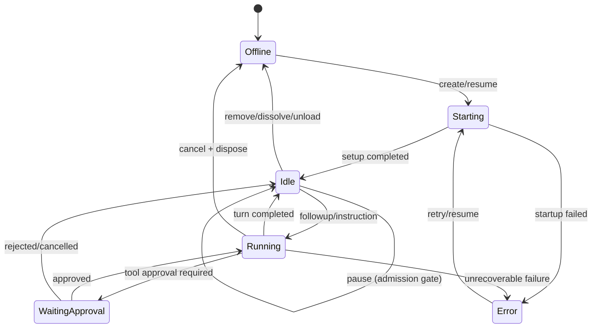
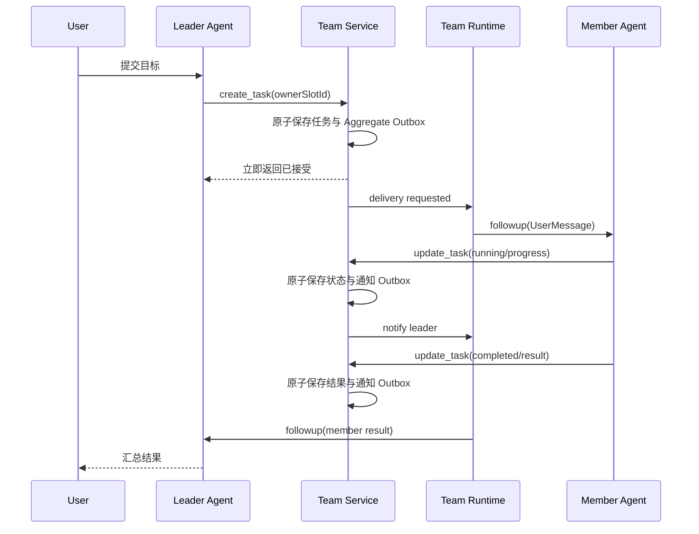

# 04. Agent 运行时与协作协议

## 目标

让多个根级独立 Agent 在同一个 Workspace 中并行执行，同时通过结构化任务板与异步信箱保持可控协作。运行时不能退化为父 Agent 调用子 Agent 的封装。

## 独立 Agent 生命周期

Harness 公开的 `AgentStatus` 只有 `idle | running`。下面是插件根据 Handle、启动流程、Session 审批事件和错误记录派生的成员状态机，不是 Harness 原生状态枚举：

Team Runtime 维护内存 Handle Registry，但真相来源是领域存储和 Harness Session 持久化。进程退出后不能依赖内存状态。

暂停只关闭任务与消息准入，成员 Handle 保持 live 并最终处于 idle。每次操作都校验 `ctx.agents.get(sessionId)` 与 Handle Registry；发现 bare Agent 存在但 Handle 不属于 Runtime 时进入 `ownership_conflict`，因为公开 API 不允许从 Registry 取回别人的 disposer。

## 成员装配

成员启动时在 `ctx.agents.create/resume` 的 `setup(agentCtx)` 中完成：

- 通过 `ctx.agentPresets.mount(agentCtx, id)` 挂载成员快照指定的 Agent Preset。
- 注册名为 `agent-team:assistant` 与 `agent-team:role` 的 Agent scope 补充提示段落，避免覆盖 Preset 的 Persona 槽位。
- 在 `setup` 内用 `systemPrompt.assemble(assembleContextFor(agentCtx.agent))` 预检两个补充段仍在最终组装中；Preset 若用 `complete: true` 排除它们，则创建在发布前失败。
- 用 `agentCtx.tools.restrict({ allow })` 限制继承的全局工具。
- 在 Agent scope 注册 Agent Team 协作工具；局部工具按 Harness 规则不受全局工具 restriction 遮蔽。
- 如需 Skill 白名单，在启动时校验 Agent-scope Catalog，并用 Agent-scope `tools.guard()` 拒绝白名单外的 `skill` 调用；当前公开 SkillRegistry 没有原生 restriction。
- Agent 创建完成、首次投递前，用 `ctx.permissionPresets.set(session, id)` 应用成员当前权限；新成员以助手模板权限为默认值，聊天窗口可独立切换，恢复 Session 时优先使用成员持久化的当前权限。
- 明确告知 Agent：它是独立团队成员，不是 Subagent；不能假设共享其他成员对话。

模型和 Provider 通过 `agentOptions` 引用 Harness 配置。Codex、GLM 或其他模型是否可用，取决于 Harness 当前 Provider 路由与用户已配置凭据；插件不自行保存 Token。

## 团队协作工具

当前向每个成员注册四个 Agent-scope 工具，并在服务端根据真实调用者身份执行权限判断：

- `team_get_task_board`：读取共享任务板。
- `team_create_task`：仅 Leader 可创建；提供 `ownerSlotId` 时，在同一次 Team Aggregate 更新中写入任务和 Outbox，随后自动唤醒负责人。
- `team_update_task`：成员只能更新自己的任务，Leader 可更新或转派任意任务；成员更新会自动通过 Outbox 通知 Leader，Leader 转派会自动唤醒新负责人。
- `team_send_message`：发送任务之外的问题、补充说明和显式沟通消息。

工具只调用 Team Service/Runtime，不返回其他 Agent Handle，也不能绕过收件人和团队边界校验。调用者身份来自当前 `exec.agent.id` 与插件 Handle Registry 的映射，不接受模型自行填写发送者身份。

## 任务指派流程

发送方拿到的是“已持久化并进入投递队列”以及本次即时投递状态，不是“目标 Agent 已完成”。运行时不在一个 Agent turn 内同步等待另一个 Agent 的整个 turn，以便真正并行。

任务与对应 Outbox 消息保存在同一个 Team Aggregate 更新中。投递成功后，消息写入消息历史并从 Aggregate Outbox 移除；投递失败时保留 Outbox，启动、恢复或重试时使用相同 MessageId 再投递。这样不会出现“任务已经分配，但因为 Leader 忘记再调用消息工具而无人启动”的状态。

## 信箱规则

- 每条普通消息先写消息表再投递；任务派发和状态通知先与任务变更一起写入 Aggregate Outbox，再投递，防止进程崩溃丢失。
- 使用幂等键避免重试产生重复任务。
- 用业务消息 ID 派生稳定 Harness MessageId；恢复时先查 inbox/Session 事件再决定是否重投。
- 接收方忙碌时消息排队；空闲时用 `followup` 开启新 turn。
- 对正在采样的 Agent，仅在 Harness 明确支持且语义合适时使用 `steer` 或 `inject`；普通业务消息默认排队，不打断当前工作。
- 大文件不直接塞入消息，使用 Workspace 相对路径和内容摘要。
- 用户、Leader、普通成员和系统消息具有明确发送者身份，不允许 Agent 伪造用户消息。

## 上下文策略

成员上下文只包含：

- 自己的独立对话 Session。
- 团队基础信息和角色。
- 分配给自己的任务及必要依赖。
- 收件箱中明确投递的消息。
- 通过工具按需读取的任务板摘要。

不会自动包含其他成员的完整会话。Leader 接收成员结果摘要和主动发送的进展，需要细节时再通过工具读取消息或打开相应成员 Session。

## Workspace 并发协作

所有成员使用同一路径。降低冲突的措施：

1. Leader 创建任务时尽量声明互不重叠的 `fileScopes`。
2. 成员开始任务时申请范围 Lease，完成或失败时释放。
3. 发现范围重叠、文件版本变化或 Git 冲突时暂停写入并通知 Leader。
4. UI 展示冲突成员、任务和路径，由用户或 Leader 重新分工。
5. 不自动执行 destructive Git 命令，也不因团队解散清理 Workspace。

Lease 是协作提示，不是安全隔离；真正的文件权限和命令审批仍由 Harness 与操作系统负责。

## 结果兜底

Agent 可能完成 turn 但忘记调用 `team_update_task`。Runtime 观察 `running -> idle` 转换后：

- 若任务已是终态，不做处理。
- 若有可用的最终输出，写入“待 Leader 审阅”的兜底结果并标记协议偏差。
- 若没有结果，任务转为 `blocked`，通知 Leader。
- 不擅自把未知状态标记为 `completed`。

## 取消、超时和故障

- 取消任务：先写入取消意图，调用 `agent.cancel(cause)`，等待 `agent.whenIdle()`，最后落终态。
- 超时：通知 Leader，可选择继续等待、取消或转派；默认不自动销毁 Session。
- Provider 故障：成员进入 `error`，保留原 Session 和队列，支持恢复后重试。
- Runtime 重启：从未完成 Outbox、成员 Session 映射和任务状态重建投递。
- 重复投递：依靠消息幂等键和任务 revision 拒绝重复副作用。

## 用户直接对话

默认入口把用户消息发给 Leader。若 `directMemberChat` 开启，用户可以进入普通成员 Session：

- 直接聊天仍记录在该成员独立 Session。
- 用户可选择“仅讨论”或“关联任务”；不自动改变任务状态。
- 普通成员不能把用户消息伪装为 Leader 指令。
- 团队暂停或删除中时 UI 转为只读或关闭入口。
- 团队工作台的每列 Composer 调用 Team Service，由服务端解析真实成员 Session 并校验团队状态后再由 Runtime 投递；Browser 不直接持有 Agent Handle。官方标准 Conversation 不被替换。首版 Approval/Question 在列内显示等待状态并跳转标准 Session 处理，避免绕过 Harness 交互策略。

## 验收标准

- 两个成员可使用不同模型并行执行，Session 和消息互不串线。
- 任务指派调用立即返回，不同步阻塞 Leader 等待成员完成。
- 进程在消息持久化后、投递前崩溃，重启不会向 Session 重复插入同一个稳定 MessageId；不对模型之外的全部外部副作用承诺 exactly-once。
- 成员忙碌、审批等待、取消、Provider 故障和恢复均有集成测试。
- 代码扫描能证明没有 Subagent API、元数据或父子 Session 关系。
