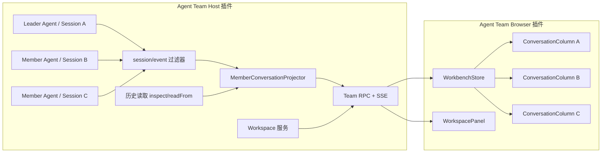

# 10. 完整团队 Conversation 工作台设计

## 当前落地状态（首版）

已完成 WB1/WB2 的可用纵向切片：Host 从成员真实 Session 事件构建隔离的 Conversation Snapshot，监听 `session/event` 并发布独立 Conversation SSE；Browser 最多并排显示三名成员，支持真实历史、流式文本/推理、通用 ToolCard、独立发送和停止。右侧 Workspace 面板提供逐层目录浏览、“文件 / 变更”页签、实时刷新和 Git Diff 预览。团队入口通过公开 `shell.overlay` Slot 直接渲染全屏工作台；工作台左侧能够切换团队，并仅在成员或任务实际运行时显示“任务执行中”。

当前流式刷新以 50ms 合并事件触发 `team.workbench.get` 权威快照重取，尚未实现按节点 upsert 的增量 Patch；专用工具卡、普通文件阅读、Conversation 虚拟列表和标准 Session 跳转仍按后续阶段执行。Approval/Question 已通过 rc7 ApiProxy mux 的待处理请求帧进入成员列，并使用原始 rpcId 经官方 `respond` seam 提交；刷新重放、取消和多页面重复回答仍由 Harness 作为权威状态管理。消息正文已复用 Harness 公开的 `MarkdownText` 原语。Git Diff 使用 `@pierre/diffs` 在 Host 端生成隔离 HTML，避免 Harness 客户端模块表加载第三方 Shiki 分块。首版没有用团队业务消息冒充 Session 历史，也没有复制官方 Conversation 内部组件。

## 目标

把当前以团队管理卡片为主的页面升级为完整的多成员 Agent 工作台。每个团队成员对应一个独立根级 Agent 和独立 Session；用户可以在同一页面同时观察和操作多个成员的完整对话，而不是只看到团队消息摘要。

本方案的完成标准是：每个可见成员列都具备接近 Harness 主 Conversation 的核心能力，包括历史消息、Markdown、流式文本、流式 reasoning、工具调用及结果、运行状态、错误、停止和继续输入。未知工具必须有通用展示，不能因为缺少专用卡片而丢失调用或输出。

本方案不修改 DeepSeek Harness 源码，不导入 Harness 未发布的 `src/*` 文件，也不把成员实现为 Subagent。

## 已确认的 Harness 能力

| 需求 | 公开能力 | 结论 |
| --- | --- | --- |
| 多个独立成员 | `ctx.agents.create/resume` + 独立 `SessionId` | 已具备 |
| 共享工作区 | `workspaceRegistry`、`Workspace.attachSession` | 已具备 |
| 实时对话事件 | Host `session/event` | 可实现 |
| 流式文本与 reasoning | `assistant/chunk` 的 `text-delta`、`reasoning-delta` | 可实现 |
| 流式工具参数 | `assistant/chunk` 的 `tool-call-delta` | 可实现 |
| 工具执行结果 | `tool/call`、`tool/result`，按 `callId` 关联 | 可实现 |
| 历史恢复 | `sessionPersistence.inspect/readFrom` | 可实现 |
| Turn/Step 状态 | `turn/start/end`、`step/start/end`、错误事件 | 可实现 |
| 官方 Conversation 组件重复嵌入 | 官方组件未作为可嵌入公共组件导出，`conversation` 为 single Slot | 不直接复用 |
| 自定义全屏工作台 | `shell.overlay` 为 root 级 list Slot | 可实现 |
| Workspace 选择和目录浏览 | Client `ctx.workspaces` 与 Host Workspace 服务 | 可实现 |
| 所有官方专用工具卡直接复用 | 专用 React renderer 未形成稳定公共嵌入 API | 需要插件实现 |

## 明确边界

### 要实现

- 三个及以上成员同时显示各自的对话历史和实时输出。
- 每列独立输入、停止和状态反馈，消息不能串到其他成员 Session。
- reasoning 默认折叠，用户可展开。
- 工具调用从参数生成、执行中到结果或失败全程可见。
- Bash、Read、Write/Edit、Diff、Search/Glob 等常用工具提供专用卡片。
- 未识别工具使用通用卡片展示名称、参数、结果和错误。
- 刷新页面、断线重连和插件重启后能够恢复历史与正在进行的状态。
- 右侧显示共享 Workspace 文件和变更信息。
- 保留团队管理能力，管理操作放在独立悬浮窗中，成员使用自适应网格，不占据工作台主体。

### 不采用

- 不复制 Harness `ConversationRoot`、`ChatView`、`InputBar` 等内部源码。
- 不注册或覆盖 `root`、`conversation`、`sidebar` 等 single Slot。
- 不用 iframe 打开多个 Harness 页面。
- 不只保存团队业务消息来冒充成员 Session 历史。
- 不把原始 Session 日志直接透传给浏览器后临时猜测含义。

## 总体架构



核心原则是 Host 端统一解释 Session 事件并输出稳定 DTO。Browser 端只负责增量 Store 和展示，不直接依赖 Persistence 格式，也不持有 `AgentHandle`。

## Session 与成员映射

`TeamAggregate.members[slotId]` 已保存成员的稳定 `sessionId`。工作台的每一列都必须以以下组合键定位：

```text
teamId + slotId + sessionId
```

- `slotId` 标识团队成员实例。
- `sessionId` 标识真实 Harness 对话历史。
- 同一助手模板重复加入团队时，仍然得到不同的 `slotId/sessionId`。
- 更换 Leader 只改变角色，不更换 Session。
- 移除成员后，该列从活动区移入只读历史，不冒充 Session 已删除。

工作台不依赖 Harness 全局“当前 Session”来驱动成员列，因此任意数量成员可以同时更新。每列提供“在标准会话中打开”作为辅助入口，调用 `ctx.sessions.open(sessionId)`，但这不是多列展示的基础。

## Host Conversation 投影

### 数据来源

1. 工作台首次打开时：
   - 活动 Session 优先读取 Team Runtime 持有的 `agent.session.events` 不可变快照。
   - 冷 Session 使用 `ctx.sessionPersistence.inspect(sessionId)`。
   - 已有投影检查点可使用 `readFrom(sessionId, nextSeq)` 只补尾部。
2. 工作台打开后：监听根级 `ctx.on('session/event')`。
3. 只接收当前插件拥有或团队历史索引明确记录的 Session；无关 Session 立即忽略。
4. Session 恢复时，构造种子事件不会重新发出 `session/event`，必须先完成历史投影，再接实时事件。

### 投影节点

Host 不向 UI 暴露可变 `Session` 对象，而是生成版本化 DTO：

```ts
type ConversationNode =
  | UserMessageNode
  | AssistantMessageNode
  | ToolCallNode
  | TurnErrorNode
  | NoticeNode

interface MemberConversationSnapshot {
  schemaVersion: 1
  teamId: string
  slotId: string
  sessionId: string
  throughSeq: number
  status: 'idle' | 'running' | 'waiting' | 'error' | 'offline'
  nodes: ConversationNode[]
  partial?: AssistantPartial
  runningCalls: ToolCallNode[]
  hasOlder: boolean
}
```

DTO 只使用 JSON 安全字段。任何新节点都带稳定 `id`，Browser 端按 ID upsert，不依赖数组位置。

### 事件折叠规则

- `user/message`：只将 `source.kind === 'user'` 的真实用户输入，以及 `source.kind === 'plugin' && plugin === 'dsh-agent-team' && form === 'relay'` 的团队转发生成可见消息节点；`instructions/catalog/snapshot/notice/recall` 等模型上下文继续参与 Session，但不进入聊天 UI。可见消息尊重 `surfaceOp` 的 append/replace 语义。
- `assistant/chunk:block-start`：创建对应 text/reasoning/tool-call partial block。
- `text-delta`、`reasoning-delta`：追加到指定 block；服务端按短时间窗口合并推送。
- `tool-call-delta`：持续更新工具名和 arguments 字符串，不要求尚未完整的 JSON 可以解析。
- `assistant/chunk:block-end`：以完整 block 替换 partial block。
- `assistant/message`：冻结最终消息，并用 `sourceEventSeqs` 清理对应 partial。
- `tool/call`：创建或确认工具调用节点，状态设为 `running`。
- `tool/result`：按 `callId` 配对，状态变为 `success/error`，保存展示所需的结果与受支持的 `meta`。
- `turn/end`：完成该 Turn 的计时和状态。
- 错误/中断：保留已生成内容，追加明确错误节点，不静默删除半截回复。
- 未识别但标记 `ignorable` 的事件跳过；未识别的 required 事件拒绝投影并显示兼容性错误，避免生成错误历史。

## Tool Call 展示系统

### 通用工具卡

所有工具至少显示：

- 工具名称。
- `waiting/running/success/error/cancelled` 状态。
- 原始参数；JSON 完整时格式化，不完整时按文本显示。
- 开始和结束时间。
- 文本结果、错误名称和错误码。
- 大输出折叠、复制和按需展开。

通用卡是强制 fallback。新增 Provider、Skill 或 MCP Tool 时，即使没有专用 renderer，也不能出现空白节点。

### 首批专用 renderer

| 工具族 | 展示内容 |
| --- | --- |
| Bash/Terminal | 命令、工作目录、stdout/stderr、退出码 |
| Read | 文件路径、行范围、带行号内容 |
| Write/Edit/StrReplace | 文件路径、操作摘要、变更 Diff |
| Glob/Search | 查询条件、命中数量、结果列表 |
| Web | URL/查询、来源和摘要 |
| Agent Team Tools | 任务、收件人、投递结果和团队实体链接 |

工具私有 `meta` 是不透明数据。只有版本和结构均经过校验的已知 `meta` 才进入专用 renderer；其他情况退回通用卡。

## Browser 工作台结构

```text
TeamWorkbench
├─ TeamNavigator
│  ├─ 团队列表 / 组建团队
│  └─ 团队任务执行状态
└─ WorkbenchMain
   ├─ WorkbenchHeader
   │  └─ 团队名称 / Workspace / 关闭
   ├─ MemberTabs / 团队管理
   ├─ WorkbenchBody
   │  ├─ MemberConversationGrid
   │  │  ├─ ConversationColumn(Leader)
   │  │  ├─ ConversationColumn(Member B)
   │  │  └─ ConversationColumn(Member C)
   │  └─ WorkspacePanel
   └─ 团队管理悬浮窗（成员网格 / Leader / 运行状态）
```

### ConversationColumn

每列包含：

1. 成员头像、助手模板名称、Leader 标识、Provider/Model、实时状态；同名成员由内部 `slotId` 区分。
2. 虚拟化或分段加载的 Conversation 时间线。
3. reasoning、Markdown、工具卡、错误节点。
4. 回到底部按钮和未读计数。
5. 独立 Composer：附件入口预留、权限提示、停止/发送按钮。
6. 放大/恢复按钮。

发送仍通过 Team API 校验 `teamId/slotId`，最终调用该成员 `Agent.followup`；Browser 不能直接获得 Agent Handle。

### 响应式布局

- 所有窗口默认打开全部成员列，不设置成员数量上限。
- 每列保持可用的最小宽度，空间不足时在成员对话区域横向滚动。
- 顶部标签可独立隐藏或恢复任意成员；新增成员默认自动加入可见列。
- 窄窗口仍保留 Workspace 和团队管理的紧凑呈现。

布局使用 Harness CSS Token 和 UI Primitives，不创建独立色系。

## 输入、停止和交互

- 空闲成员：提交普通消息使用 `followup`。
- 运行成员：默认新消息排队为下一 Turn；是否开放 `steer` 作为显式动作由产品设置决定。
- 停止：对目标成员调用 `cancel({ kind: 'user' }, { keepInbox: true })`，只影响该成员。
- 单成员停止：取消该成员当前输出，Session 与后续对话能力保留。
- 清空任务与上下文：使用 `cancel(..., { keepInbox: false })` 完全清除待处理输入，等待所有成员空闲后 dispose 旧 AgentHandle，再为原有 slot 分配全新 Session ID。Harness 无公开日志截断 API，因此不篡改旧 Session；旧日志保留但不再进入团队模型上下文。
- 发送失败：输入草稿保留，显示可重试错误。
- 用户与普通成员直接对话仍受 `directMemberChat` 策略约束。

Approval 和 Question 属于 Harness Connection 的临时交互，不只存在于持久 Session 日志。rc7 已通过 `apiProxy.events.mux` 和 `apiProxy.respond` 公开安全 response carrier：Host 只消费一条官方 mux，按插件拥有的 Session 投影“等待审批/等待回答”卡片，并携带原始 rpcId 提交允许一次、拒绝或结构化答案。成员工作台与团队 Agent 小助手共享这条桥接；刷新重放、取消和重复回答仍由 Harness 判定，插件不伪造 Session 事件或批准结果。

## RPC 与 SSE 设计

在现有 `/agent-team/api` 与 `/agent-team/events` 上扩展，不增加任意路径路由。

### RPC

| Method | 作用 |
| --- | --- |
| `team.workbench.get` | 团队、成员、Workspace 和每列初始快照 |
| `team.conversation.history` | 按成员和锚点加载更早节点 |
| `team.message.send` | 向指定成员发送普通消息，沿用现有方法 |
| `team.member.stop` | 停止单个成员当前活动 |
| `team.member.steer` | 可选的显式运行中引导 |
| `team.workspace.list` | 列出 Workspace 目录层级 |
| `team.workspace.read` | 受限读取工作区文件 |
| `team.workspace.changes` | 检测 Git 根目录并返回共享工作区变更摘要 |
| `team.workspace.diff` | 按已暂存或工作区范围生成单文件 Diff 预览 |

所有请求使用严格 Schema、Body 上限和成员归属校验；历史与文件内容必须分页或限长。

### SSE

新增事件类别：

- `member.conversation.patch`
- `member.status.changed`
- `member.interaction.changed`
- `workspace.changed`

每个 Conversation SSE 事件同时携带全局 `cursor`、成员 `slotId`、Session `throughSeq`、实时 Agent 状态和该成员的最新 Conversation 快照。Browser 只替换对应成员列；发现 cursor 跳跃、Session seq 不连续或 schema 不兼容时，不猜测丢失内容，直接重新调用 `team.workbench.get`。重连成功后也重新取得一次基线快照。

Browser 内所有 Agent Team 消费者共享一个 EventSource，由单例事件 Hub 按 `change`/`conversation` 和 `teamId` 分发。侧栏、团队列表和工作台不得各建长连接，避免与 Harness 自身事件通道共同耗尽浏览器同源连接槽，导致普通 RPC 饥饿。

流式 token 不逐个触发 React render。Host 或 Browser 在不改变字符顺序的前提下按约 16–50ms 批量发布；`block-end`、`tool/call`、`tool/result`、错误和 Turn 结束立即发布。

发送后 Browser 先显示使用服务端 MessageId 对齐的乐观用户消息，Session 投影出现同 ID 节点后自动去重。停止操作调用 `agent.cancel({ kind: 'user' })` 清理当前活动和待处理 Inbox，并等待 `whenIdle()` 后再完成；UI 在此期间明确显示“停止中…”。

## Workspace 面板

- 文件树基于规范 `workspacePath`，所有请求都重新验证真实路径仍位于 Workspace 内。
- 拒绝 `..`、符号链接逃逸和未经授权的绝对路径。
- 文件内容按大小、文本类型和行数限制读取；二进制文件只显示元数据或使用明确支持的预览。
- “文件 / 变更”页签共享一个 Workspace 面板；非 Git 根目录显示明确空状态，第一版不向上查找父仓库，也不猜测多个子仓库。
- Host 使用 Chokidar 监听普通文件以及 `.git/index`、`.git/HEAD`、`.git/refs`，合并连续事件后通过既有单例 SSE 发布 `workspace.changed`；Browser 收到失效通知后重新请求权威目录与 Git 状态。
- “变更”视图基于 `git status --porcelain=v1 -z`，按冲突、已暂存、已修改和未跟踪分组；点击文件打开自定义预览弹窗，支持统一/分栏布局和 Harness 亮暗主题。预览通过 `@pierre/diffs/ssr` 生成，并挂载到 Shadow Root 隔离样式。
- Git 能力只执行 status/diff 等只读命令，不自动执行 reset、checkout、commit 等写操作。
- 点击聊天中的 Workspace 相对路径可以定位文件，但不能把模型输出的路径直接当成已授权路径。

## 状态、重连和一致性

- 每个成员 Store 记录 `throughSeq`；重复 patch 幂等忽略。
- SSE 断开时保留最后视图，标记“正在重连”，暂时禁用可能重复提交的动作。
- 重连先拉权威快照，再恢复 SSE，不依赖服务器保留无限事件。
- 插件重启后 Team Runtime 先恢复 Agent，再由 Conversation Projector 从 Session 历史重建列。
- 成员失败不阻塞其他列；团队顶部状态明确显示部分失败。
- Session 被移除或 Workspace 失效时，该列进入只读错误状态。

## 性能与容量

- 首屏每列只返回尾部可见节点；旧历史按需加载。
- Tool 大输出默认折叠，并设置单响应最大字节数。
- Browser Store 按 Session 隔离订阅，单列增量不能导致整个工作台全量重渲染。
- reasoning/text delta 批处理，但工具完成、错误和用户操作不延迟。
- 工作台关闭后释放 Browser 订阅；Host 的全局事件监听仍由插件 Fiber 统一拥有并在卸载时销毁。

## 安全要求

- Browser 不能访问 `AgentHandle`、领域存储或 Provider 凭据。
- 所有成员操作从服务端 TeamAggregate 解析真实 Session，拒绝 Browser 自报 Session ID 越权。
- 日志不记录完整 Prompt、文件内容、工具输出或 Credential。
- 工具参数和结果按普通对话敏感数据处理，不广播给其他团队。
- 工具审批继续服从 Harness Permission Preset，不因团队工作台而绕过。
- 禁止导入 `@deepseek-ai/*/src/*` 或复制官方 Conversation 内部组件。

## 分阶段实施

### WB1：Conversation 数据平面

- 建立成员 Session 索引和 `session/event` 过滤器。
- 实现历史读取、事件折叠、快照与 patch DTO。
- 扩展 SSE cursor/seq 一致性。
- 为 streaming、tool call/result、错误和重启恢复编写测试。

退出标准：三个测试 Agent 同时运行时，Host 可产生三个互不串线、可重放的 Conversation Snapshot。

### WB2：多列工作台与通用工具卡

- 实现全屏 `TeamWorkbench`、成员标签、响应式列和独立 Composer。
- 实现 Markdown、reasoning、通用 ToolCard、错误、停止和自动滚动。
- 当前团队卡片页面收敛为团队管理悬浮窗/设置入口。

退出标准：用户能在任意成员列分别发送消息，同时看到流式回复和任意工具的完整通用卡片。

### WB3：专用工具卡与 Workspace 面板

- 实现 Bash、Read、Edit/Diff、Search 等专用卡片。
- 实现文件树、文件阅读、变更列表和路径跳转。
- 加入大输出折叠与渲染性能测试。

退出标准：真实编码任务中的主要工具调用无需查看原始 JSON 即可理解。

### WB4：交互、可访问性与稳定性

- [x] 接入 rc7 官方 Approval/Question mux 与响应能力，并覆盖成员工作台和团队 Agent 小助手。
- 完成键盘、焦点、屏幕阅读器、小窗口和多成员压力测试。
- 完成断线、乱序、重复事件、成员失败和冷恢复测试。

退出标准：工作台在异常和重连场景中不丢消息、不重复消息、不误批准工具。

## 验收清单

- [ ] 三个平级根 Agent 使用三个独立 Session 和同一 Workspace。
- [x] 任意数量成员列可同时接收并显示流式 text/reasoning。
- [ ] 工具参数流、执行中、结果、错误完整展示。
- [ ] 未知工具始终落入通用工具卡。
- [ ] 刷新、SSE 重连和插件重启后历史一致。
- [ ] 每列发送和停止只影响目标成员。
- [ ] Leader 变更不丢失原成员历史。
- [ ] Workspace 文件树和变更视图不能越出团队目录。
- [ ] UI 使用 Harness Token/Primitive，支持明暗主题和响应式布局。
- [ ] 不覆盖 Harness single Slot，不导入私有源码，不使用 Subagent。

## 最终产品判断

该工作台可由当前外部插件架构实现。实现成本主要在完整 Conversation 投影和工具展示层，而不在 Agent 运行时。最终用户体验可以达到“三个完整 Agent 聊天框并排工作”的效果；差异是插件实现自己的稳定 renderer，而不是嵌入三份官方内部 Conversation 组件。
