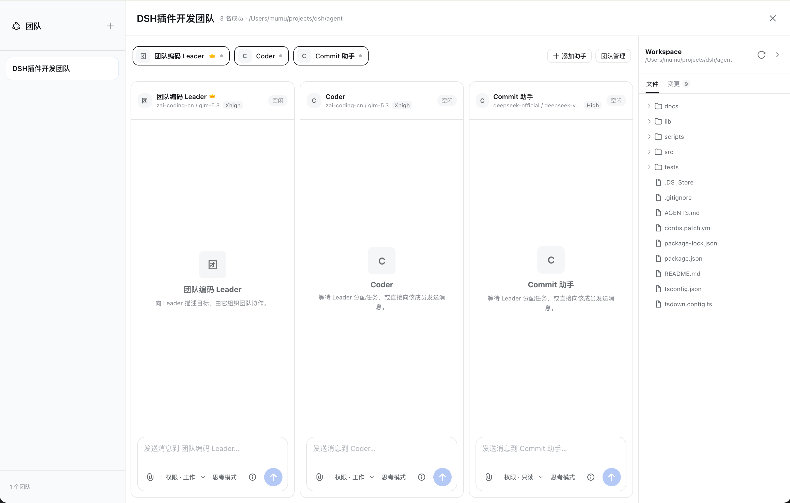

# Agent Team User Guide

[Main README](../README.md) · [Chinese README](../README_CN.md)

Agent Team is a DeepSeek Harness Web plugin for building teams of independent, peer-level AI Agents. Every member has its own model, session, context, and tool activity while sharing one Workspace and collaborating through team tasks and messages.

## How It Differs from Common Subagent Workflows

Agent Team does not implement members as temporary children of the Leader. It creates an independent root Agent for each role so models, tools, permissions, and context can be separated by responsibility.

| Capability | Value |
| --- | --- |
| Independent model per member | Use a capable model for planning and more focused or economical models for coding, testing, or commit messages |
| Independent Skills and MCP per member | Avoid loading unrelated capabilities into every Agent |
| Independent context per member | Keep implementation detail with specialists while the Leader receives progress and results |
| Independent permissions per member | Give reviewers read-only access and coders Workspace write access |
| Explicit team messages | Route tasks, progress, and results to stable member IDs, even when names are duplicated |

## Where to Start

| Goal | Guide |
| --- | --- |
| Install and start the plugin | [Installation and startup](./installation.md) |
| Create Leader, Coder, or other roles | [Assistant library](./assistants.md) |
| Select members and create a team | [Creating teams](./creating-teams.md) |
| Use multi-member chat and collaboration | [Workbench and collaboration](./workbench.md) |
| Browse files and inspect Git changes | [Workspace and Git changes](./workspace.md) |
| Add/remove members, clear, or dissolve a team | [Team management](./team-management.md) |
| Resolve installation, model, or UI problems | [Troubleshooting](./troubleshooting.md) |

## Core Concepts

### Assistant

An assistant is a reusable role template containing a Provider, model, Agent Preset, default permission, reasoning mode, Skills, MCP Servers, and long-term instructions. It starts running only after it is added to a team.

### Team Member

A team member is a snapshot of an assistant running inside a specific team. Adding the same assistant multiple times creates distinct member IDs, sessions, and contexts.

### Leader

Every team has exactly one Leader. The Leader understands goals, splits work into tasks, assigns members, receives status, and verifies results. It is not the parent of the other Agents.

### Workspace

All members share one Workspace and can work on the same files. Each member's current session permission determines whether it may modify those files.

## Recommended Workflow

1. Configure Providers, models, and credentials in Harness.
2. Open **Settings → Agent Team** and create at least one Leader and one regular assistant.
3. Open the floating **Team** button, click `+`, and select members, the Leader, and a Workspace.
4. Describe the complete goal to the Leader in the workbench.
5. Watch assignments, execution, status reports, and final verification.
6. Message a member directly or adjust membership when necessary.

## Data and Security Boundaries

- Harness Profile manages Provider API keys and MCP credentials; Agent Team does not store them.
- Template permissions are initial defaults and may be changed per member session.
- Dissolving a team does not delete assistant templates or Workspace files.
- Cleared or dissolved sessions are no longer restored by Agent Team, although Harness may retain underlying logs.

## Getting Help

If these guides do not resolve a problem, open a [GitHub issue](https://github.com/Leonard-Data/agent-team/issues) with the Harness and Agent Team versions, reproduction steps, error text, and sanitized screenshots. Remove API keys, tokens, and private paths first.
