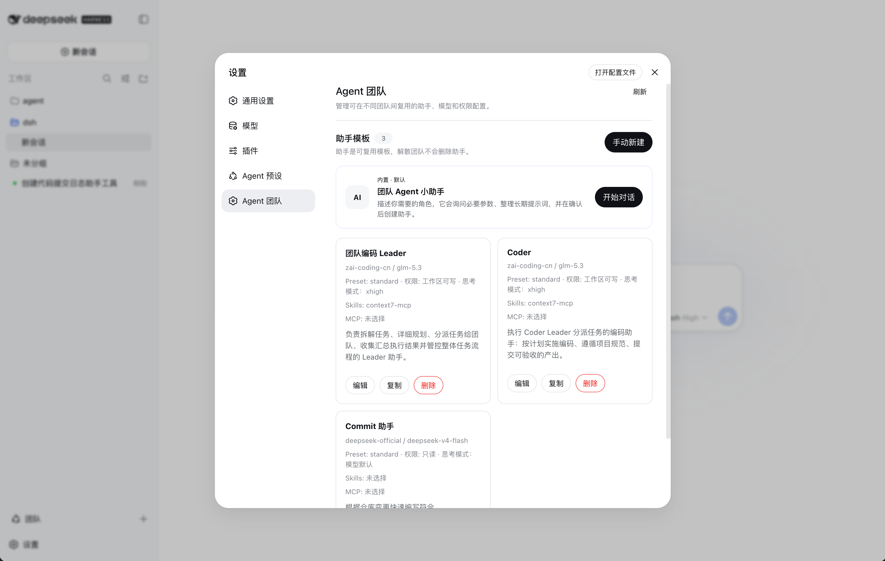
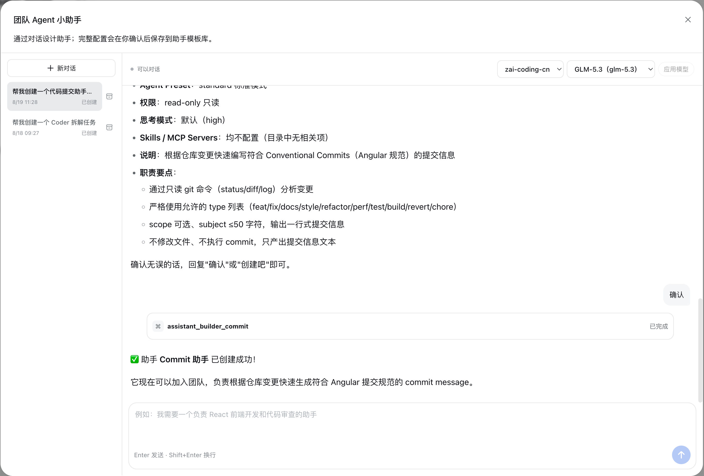

# Assistant Library

[Previous: Installation](./installation.md) · [Documentation index](./README.md) · [Next: Creating teams](./creating-teams.md)

Assistants are reusable role templates. Dissolving a team does not delete them, and deleting a template does not directly delete previously created Harness sessions.

## Open the Library

Go to **Settings → Agent Team**.



Each card shows the model, Preset, default permission, reasoning mode, Skills, MCP Servers, and role description. You can edit, duplicate, or delete an unreferenced template.

## Create with the Team Agent Assistant

Click **Start conversation** on the built-in card and describe the role in natural language:

```text
Create an assistant for React frontend development and code review. Use a GLM model and Workspace write permission by default.
```

The assistant collects missing settings, prepares a complete configuration, and creates the template only after explicit confirmation.



The builder supports separate conversation histories. A new conversation does not create a real session until its first message is sent.

## Create Manually

Click **Create manually** and configure these fields:

| Field | Purpose |
| --- | --- |
| Name | Display name in the library, member list, and conversation header |
| Description | Short role summary used when building a team |
| Provider / Model | Default model source and model |
| Agent Preset | Base prompt, tools, and runtime behavior |
| Permission preset | Initial member permission; editable in the workbench |
| Reasoning mode | A level reported by the model capability catalog |
| Skills | Skills the model may load or the user may invoke with `/` |
| MCP Servers | Configured MCP Servers this assistant may use |
| Assistant instructions | Stable role, constraints, workflow, and reporting rules |

Keep instructions stable and role-focused. Do not put a one-off team task in the template.

## Permissions and Reasoning

- Template permission is only the member's initial default and can be changed per session.
- Reasoning options come from Harness model capabilities and vary by model.
- Workbench reasoning changes apply from the next turn.

## Skills and MCP

- Skills come from the selected Agent Preset. A user-only Skill is marked **Slash command only**.
- Harness Profile manages MCP connections and credentials; templates store only allowed Server names.
- If either catalog is empty, check the Harness Profile and Agent Preset configuration.

## Template Snapshots

Adding an assistant to a team creates an immutable configuration snapshot so live members do not unexpectedly change when a template is edited. Edits affect new members only. Remove and re-add an existing member to apply an updated template.

## Delete an Assistant

Deletion is blocked while any team member references the template. Remove those members or dissolve their teams first.
