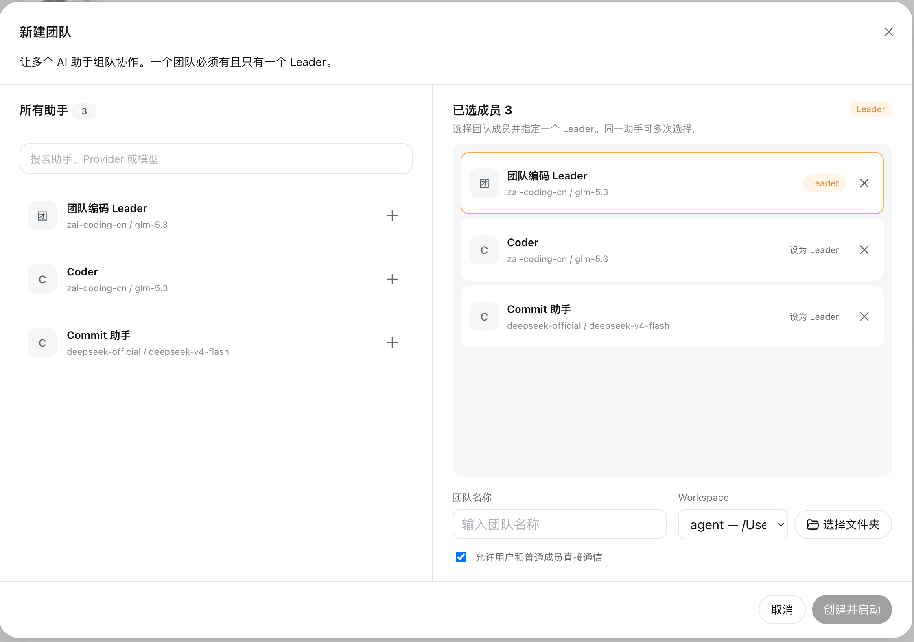

# Creating Teams

[Previous: Assistant library](./assistants.md) · [Documentation index](./README.md) · [Next: Workbench](./workbench.md)

Prepare at least one assistant suitable for the Leader role and one regular member before creating a team.

## Open the Team Creator

Click the floating **Team** button to open the Agent Team workbench, then click `+` above the team list.

## Select Members

The assistant library appears on the left and selected members on the right:

1. Click `+` beside an assistant to add it.
2. Add the same assistant more than once to create independent member instances.
3. Select exactly one member as the Leader.
4. Click `×` to remove a selection before creation.

There is no fixed member limit. Wider teams remain usable through horizontally scrollable conversation columns.

## Team Settings

Use a descriptive team name, then select the Workspace shared by every member. Choose an existing Harness Workspace or click **Choose folder** to add one through the Harness directory picker. Verify the directory carefully because members read and modify files there.

Enable **Allow users to message regular members directly** to let users bypass the Leader and chat with specialists. When disabled, regular members primarily receive tasks and team messages from the Leader.

## Create and Start

Click **Create and start**. The plugin creates an independent session for every selected member, associates all sessions with the Workspace, injects team roles and collaboration tools, and opens the full-screen workbench. There is no separate start step.

## Suggested Team Shapes

For software development, use a Leader for planning and verification, a Coder for implementation, a Reviewer for risk checks, and a Tester for regression coverage. For content work, combine a planning Leader with Researcher, Writer, and Reviewer roles.

Models do not need to match. A capable planning model can lead while focused or lower-cost models perform execution. Every member retains an independent session, so detailed code or research output does not consume the Leader's context.
